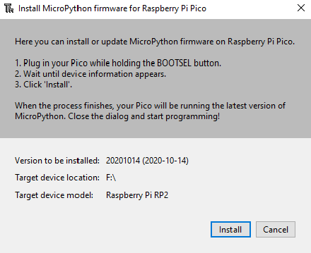

## Set up Raspberry Pi Pico W

Connect your Raspberry Pi Pico and set up MicroPython.

MicroPython is a version of the Python programming language for microcontrollers, such as your Raspberry Pi Pico. MicroPython lets you use your Python knowledge to write code to interact with electronics components.

--- task ---

**Connect** the small end of your USB cable to the Raspberry Pi Pico.

--- /task ---

--- task ---

**Connect** the other end to your computer, laptop, or Raspberry Pi.

--- /task ---

--- task ---

Open the Thonny editor. 

--- /task ---

--- task ---

Look at the text in the bottom-right corner of the Thonny editor. It will show you the version of Python that is being used.

If it does not say "MicroPython (Raspberry Pi Pico)", then click on the text and select "MicroPython (Raspberry Pi Pico)".

If you have never used MicroPython on your Raspberry Pi Pico, then Thonny will prompt you to add the MicroPython firmware. Click **Install**. 

--- /task ---

--- task ---

**Debug:** 

--- collapse ---
---
title: There was an error installing the firmware
---

If you see an error message during the install then:
+ Disconnect your Raspberry Pi Pico
+ Reconnect your Raspberry Pi Pico
+ Try to install the firmware again (you might need to press the stop button first)

--- /collapse ---

--- collapse ---
---
title: I don't know if the firmware is installed and cannot connect to my Pico
---

Make sure your Raspberry Pi Pico is connected to your computer with a micro USB cable. Click on the list in the bottom-right corner of your Thonny window. A pop-up menu will appear, which lists the available interpreters. 

 

If you cannot see the Pico in the list (like in the picture), you will need to reconnect your Raspberry Pi Pico while holding the BOOTSEL button to mount it as a storage volume, and reinstall the firmware by following the instructions in the section above.

--- /collapse ---

--- collapse ---
---
title: Firmware is installed but I still cannot connect to my Pico
---

You may be using the wrong kind of micro USB cable. Your current micro USB cable may be damaged, or designed only to carry power to devices and cannot transfer data. Try swapping your cable if nothing else has worked. 

If your Pico still won't connect after trying all these things, it may **itself** be damaged and unable to connect. 

--- /collapse ---

You can find further information in the [Raspberry Pi Pico Guide](https://projects.raspberrypi.org/en/projects/introduction-to-the-pico){:target="_blank"}.

--- /task ---

`picozero` is a MicroPython library for beginners to the Raspberry Pi Pico. 

--- task ---

To complete the projects in this path, you will need to install the `picozero` library as a Thonny package.

In Thonny, choose **Tools** > **Manage packages**.

--- /task ---

--- task ---

In the pop-up 'Manage packages for Raspberry Pi Pico' window, type `picozero` and click **Search on PyPi**.

--- /task ---

--- task ---

Click on **picozero** in the search results. 

Click on **Install**.

When installation has completed, close the package window, then exit and reopen Thonny.

--- /task ---

If you have difficulties installing the `picozero` library in Thonny, you can download the library file and save it to your Raspberry Pi Pico. 

[[[picozero-offline-install]]]
